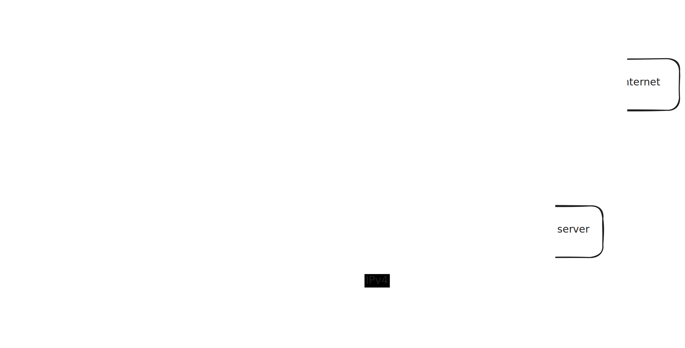

# pterodapter


pterodapter is a userspace Proxy-to-FortiVPN adapter that acts as

* an L5 open standard SOCKS5/HTTP/CONNECT proxy server
* or an L3 IKEv2 VPN server (a subset of [RFC 7296](https://datatracker.ietf.org/doc/html/rfc7296) is implemented)

and forwards traffic to a FortiVPN network.



## Proxy mode

No drivers to install or root access to create tun/utun devices.

As it can be used with [PAC files](https://en.wikipedia.org/wiki/Proxy_auto-config), hostname-based routing might be a lot easier.
(especially if the IP address keeps changing, and routing tables keep getting out of date).

[smoltcp](https://github.com/smoltcp-rs/smoltcp) emulates L3 physical hardware and allows conversion of L5 (SOCKS5/HTTP/CONNECT proxy) traffic into L3 packets.

## IKEv2 VPN mode

Root permissions are not required, but unfortunately most IKEv2 clients can only use standard ports 500 and 4500.
Listening on port 500 requires elevated permissions or port-forwarding; the IKEv2 server needs to run externally to prevent port conflicts.

To avoid granting root permissions, the following command grants permissions to listen on ports < 1024 without granting full root access:

```shell
sudo setcap CAP_NET_BIND_SERVICE=+eip pterodapter
```

# How to use it

Build/download a copy, and follow the Proxy or IKEv2 VPN instructions.

## Proxy

Run pterodapter with the following arguments:

```shell
pterotapter [--log-level=<level>] [--listen-address=<hostport>] --destination=<hostport> [--pac-file=<path>] [--tunnel-domain=<suffix>] proxy
```

`--log-level=<level>` is an optional argument to specify the log level, for example `--log-level=debug`.

`--listen-address=<hostport>` is an optional argument to specify the proxy listen address, for example `--listen-address=127.0.0.1:3128`. If not specified, will use `:::5328` as the listen address (all IPv4 and IPv6 addresses, port 5328).

`--destination=<hostport>` specifies the FortiVPN connection address, for example `--destination=fortivpn.example.com:443`.

`--pac-file=<path>` specifies the optional filename/path for a [PAC file](https://en.wikipedia.org/wiki/Proxy_auto-config). This pac file will be available at the listen address' `/proxy.pac` path, and can be used to self-host a PAC file for browsers/clients that support it.

`--tunnel-domain=<suffix>` specifies an optional argument indicating that only domains matching `<suffix>` should be sent through the VPN, and all other domains should use a direct connection. Multiple domains can be specified; if no `--tunnel-domain` arguments are specified, all traffic will be sent through the VPN.

For example:

```shell
./pterodapter --log-level=trace \
    --listen-address=127.0.0.1:3128 \
    --destination=fortivpn.example.com:443 \
    --pac-file=custom.pac \
    --tunnel-domain=gitlab.example.com \
    --tunnel-domain=registry.example.com \
    --tunnel-domain=-ci.example.com \
    proxy
```

Example contents of a PAC file:

```javascript
function FindProxyForURL(url, host) {
    // Gitlab
    if (shExpMatch(host, "gitlab.example.com"))
        return "SOCKS 127.0.0.1:3128";

    // Registry
    if (shExpMatch(host, "*.registry.example.com"))
        return "PROXY 127.0.0.1:3128";

    // Direct connection by default
    return "DIRECT";
}
```

### How to set up a client

Configure your browser to use a PAC file, for example:

```shell
networksetup -setautoproxyurl "Wi-Fi" "http://localhost:5328/proxy.pac"
```

To enable SSH proxying, add this to `~/.ssh/config` (specify the path to `git-proxy-command.sh`):

```
Host ssh.gitlab.example.com
    ProxyCommand nc -x localhost:5328 %h %p
```

To use most CLI tools, set the following environment variables:

```shell
export HTTP_PROXY=http://localhost:5328
export HTTPS_PROXY=http://localhost:5328
export NO_PROXY=127.0.0.0/8,10.0.0.0/8,172.16.0.0/12,192.168.0.0/16
```

For containers running in Podman Machine, use `host.containers.internal` instead of `localhost`.

## IKEv2 VPN

Run pterodapter with the following arguments:

```shell
pterotapter [--log-level=<level>] [--listen-ip=<ip-address>] [--ike-port=<port>] [--nat-port=<port>] --destination=<hostport> [--tunnel-domain=<domain>] [--rnat-cidr=<ip4cidr>] [--id-hostname=<hostname>] --cacert=<filename> --cert=<filename> --key=<filename> ikev2
```

`--log-level=<level>` is an optional argument to specify the log level, for example `--log-level=debug`.

`--listen-ip=<ip-address>` is an optional argument to specify the proxy listen IP address, for example `--listen-ip=127.0.0.1`. If not specified, will use `::` as the listen address (all IPv4 and IPv6 addresses). Multiple addresses can be specified.

`--ike-port=<port>` is an optional argument to specify the IKEv2 listen port, for example `--ike-port=9500`. If not specified, will use port 500 (the default IKEv2 port).

`--nat-port=<port>` is an optional argument to specify the NAT port for IKEv2 and ESP, for example `--nat-port=9501`. If not specified, will use port 4500 (the default IKEv2 and ESP NAT port).

`--destination=<hostport>` specifies the FortiVPN connection address, for example `--destination=fortivpn.example.com:443`.

`--tunnel-domain=<domain>` specifies an optional argument indicating that only `<domain>` should be sent through the VPN, and all other domains should use a direct connection. To specify multiple domains, add a `--tunnel-domain` argument for each one; if no `--tunnel-domain` arguments are specified, all traffic will be sent through the VPN.
This is implemented using IKEv2 traffic selectors and works as expected on macOS; Windows seems to have [issues with split routing](https://docs.strongswan.org/docs/5.9/howtos/forwarding.html#_split_tunneling_with_ikev2).
To ensure that dynamic IPs are handled correctly, pterodapter will send updated routes (IKEv2 Traffic Selectors) when the client rekeys the session.
If `--rnat-cidr` is specified, subdomains will also be tunneled (e.g. `--tunnel-domain=example.com` will also route traffic to `subdomain.example.com`); otherwise (no `--rnat-cidr` is specified), only complete domain matches will be routed to the VPN.

`--rnat-cidr=<IP4CIDR>` specifies an optional argument indicating that RNAT mode should be enabled, for example `--rnat-cidr=192.168.40.0/24` will create a virtual subnet matching `192.168.40.0`-`192.168.40.255`.
In RNAT mode, pterodapter will intercept DNS responses and remap external IP addresses to unused addresses on the RNAT subnet.
This is done only for domains matching a suffix listed in `--tunnel-domain`.
All IP traffic sent to a remapped address will be sent to the original external address.
This approach simplifies the routing table (IKEv2 Traffic Selector) to use only one network or traffic selector; it also allows to use domain suffixes and handle DNS updates without reconnecting the client.
RNAT (Revese NAT) is similar to [NAT hairpinning](https://en.wikipedia.org/wiki/Network_address_translation#NAT_hairpinning) but serves a different purpose.

`--destination=<hostport>` specifies the hostname to send to the client when performing a client handshake. If not specified, will use `pterodapter` as the hostname. Windows refuses to connect if the hostname doesn't match connection settings; macOS prints a warning in the Console.

`--cacert=<filename>` specifies the path to a root CA PEM file, required for two-way authentication.

`--cert=<filename>` specifies the path to the server's public cert PEM file, required for two-way authentication.

`--key=<filename>` specifies the path to the server's private key PEM file (matching the public cert specified in `--cert`), required for two-way authentication.

For example:

```shell
./pterodapter --log-level=trace \
    --listen-ip=127.0.0.1 \
    --destination=fortivpn.example.com:443 \
    --tunnel-domain=gitlab.example.com \
    --tunnel-domain=registry.example.com \
    --id-hostname=pterodapter.home \
    --cacert=vpn-root.cert.pem \
    --cert=vpn-server.cert.pem \
    --key=vpn-server.key.pem \
    proxy
```

For more information how to generate certs and configure clients, see the [certs.md](docs/certs.md) document.

For information how to run pterodapter as a systemd unit, see the [systemd.md](docs/systemd.md) document.

# Reference

## FortiVPN implementations

Used to study and re-implement the FortiVPN protocol:

* [openfortivpn](https://github.com/adrienverge/openfortivpn)
* [OpenConnect](https://www.infradead.org/openconnect/)

The idea of using a proxy (to run as non-root) was originally suggested in [the OpenConnect documentation](https://www.infradead.org/openconnect/nonroot.html).

## WireGuard gateways

WireGuard's VPN client is available in the App Store, and supports split tunneling out of the box.
Could be a possible alternative to proxies - keep split tunneling, but avoid conversion between OSI layers.

These examples show how to do L2/L3 conversion and emulate remote endpoints.

* [onetun](https://github.com/aramperes/onetun) - listen on a socket and redirect to a server through WireGuard
* [wgslirpy](https://github.com/vi/wgslirpy) - runs a WireGuard server and redirects to an external service
